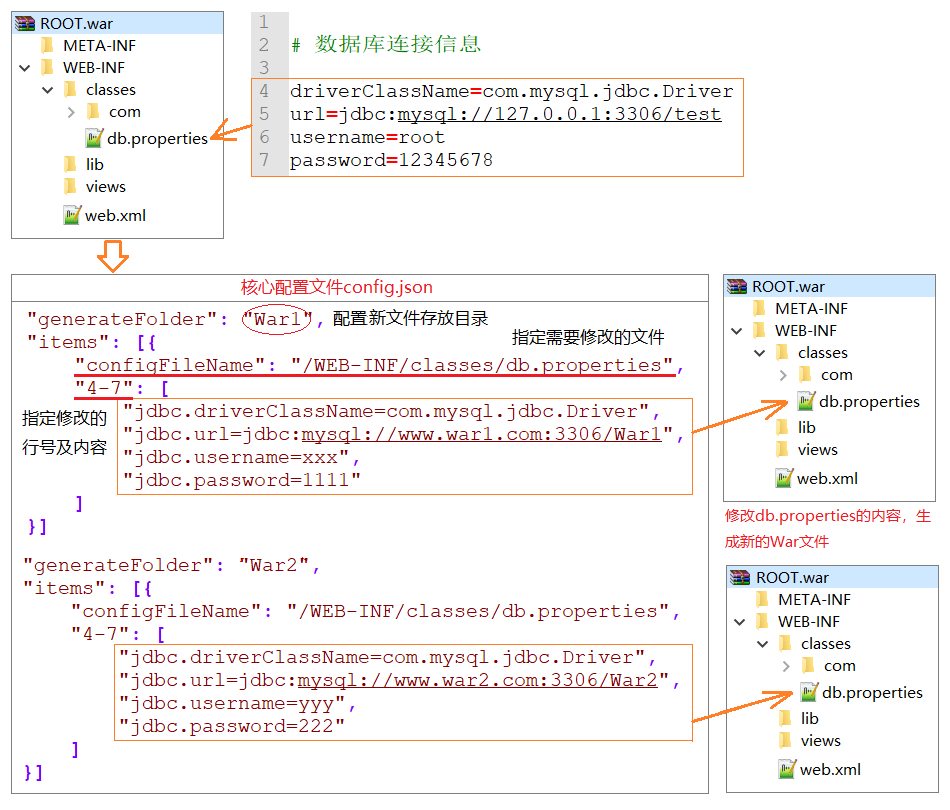

# batch-package
War包批量生成工具，可动态修改War包中的文本内容（如数据库连接信息），修改后进行二次打包

**Example：将War文件复制10份（批量部署），需要修改其中的db.properties配置文件**



### 环境要求

```
运行环境：JDK1.7或更高版本
```

### 快速开始

1. 下载项目中的 [batch-package-1.0.RELEASE-dist.zip](https://raw.githubusercontent.com/hxulin/batch-package/master/batch-package-1.0.RELEASE-dist.zip) 文件，并解压

2. 在解压目录中，运行以下命令：

   ```bash
   java -jar batch-package-1.0.jar
   ```

   > windows系统也可以直接双击运行startup.bat

   此时在你的目录中会生成 \_bak，\_gen，\_tmp三个目录，**\_gen目录中就存放着最终生成的文件**。

   <br>

   &emsp;&emsp;以上是一个快速的测试用例。你可以查看配置文件config.json以及最终生成的文件，了解它的配置方法。当然\_gen目录中测试生成的每一个ROOT.war也是可以直接放到Tomcat中运行并访问的。

   <br>

3. 将你的 ROOT.war 文件放到解压目录中（原有的ROOT.war是测试文件，可以覆盖）

4. 修改config.json文件中的配置

5. 接着操作第2步就可以自定义生成了

<br>

**生成策略等高级配置，详见[这里](https://ldxy.tech/2018/11/25/batch-package/)**

